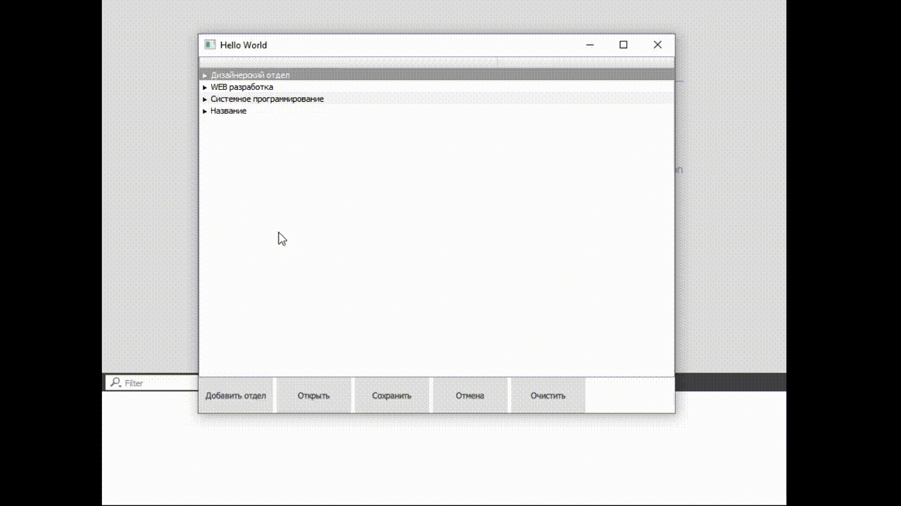

# DepartmentEditor
* TreeModel - Модель TreeView
* TreeNode - Нода, хранящая название и тэг
* XmlEditor - Сохранение и загрузка из .xml файла в модель
* History - Хранение состояний
## Demonstration

